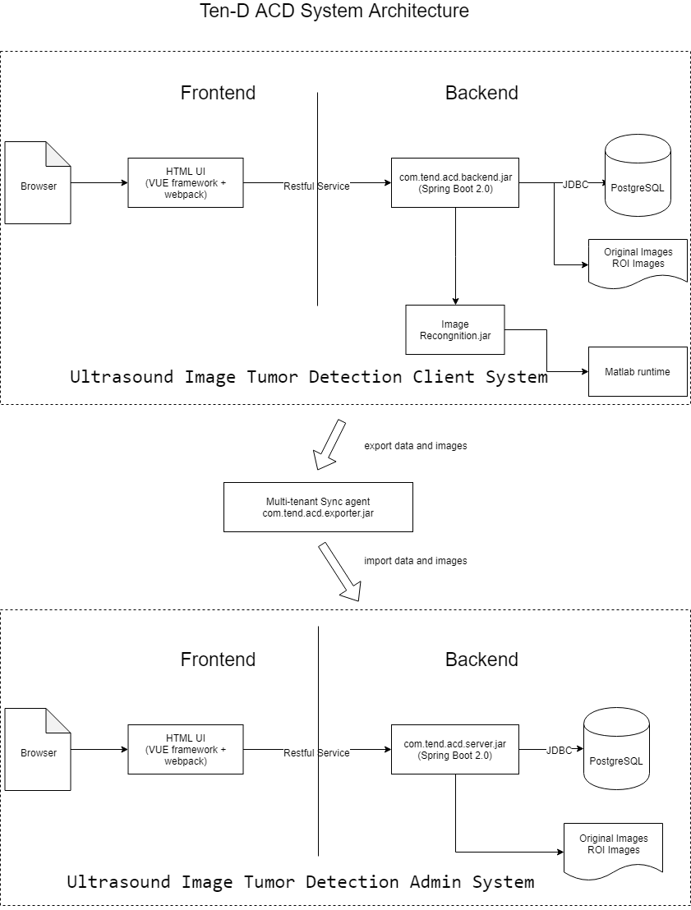

# Ten-D ACD System
A web based automatic ultrasound cancer diagnosis system

> ## Architecture

> ## Setup
- install JAVA 8.0 +
- install Maven latest
- install Nodejs 10.15.0 +
- install npm 6.5.0 + 
- install MATLAB runtime R2018b (9.5)  
- install PostgreSQL latest
- Add /lib/Image_Recognition.jar (core cancer diagnosis library, built by MATLAB)

> ## How to release and run
- mvn package
- java -jar backend\target\com.tend.acd.backend-0.0.1-SNAPSHOT.jar
- start http://localhost:8080/

> ## How to run local
- npm run serve --prefix frontend
- mvn spring-boot:run -f backend/pom.xml
- start http://localhost:3000/

> ## Image Cropper
https://fengyuanchen.github.io/cropperjs/